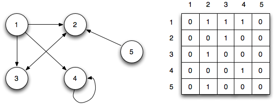
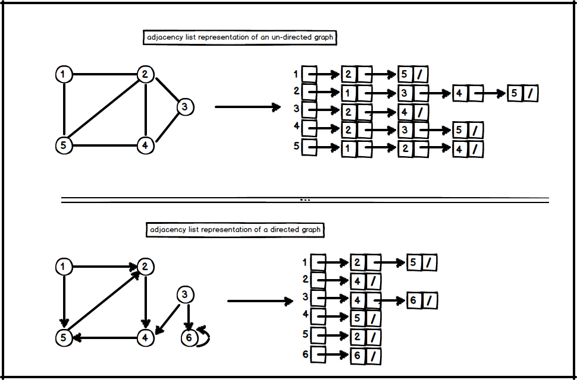

# Data Structures
The goal of this document is to cover almost all the data structures you have heard and read. This is believed to help 
students and Engineers to understand and have better grasp of Data Structures used in daily life. Problem solving still 
mostly constitutes of knowledge of data structures. Specially knowledge of DS comes handy whenever you try to model 
solution to Real world problems. For example:-

Say you have to solve the puzzle called "Tonor of Honoi". See this link if you are unaware of this puzzle 
[https://en.wikipedia.org/wiki/Tower_of_Hanoi]. In this problem, to model the towers, the most suited Data Structure 
would be three "Stacks". Because, the way you pile and remove "rings" on the tower is "LIFO". Also, there are only two 
operations you can perform on the "tower" like `push` and `pop`. 

## Structures [Struct]
`Structure` is a data structure designed to hold datum of different types in a collection. While modeling data one 
must make sure that only co-related data are represented. Each item in the structure is identified by an identifier. 
And, the identifiers are known as members or fields.  
**Example:**  
```c
struct {
  char first[10];
  char midinit;
  char last[20];
} sname, ename;
```
In this way, you are only creating two struct variables. You cannot create new variables of the strcture you have just 
defined anywhere else you in your program. Alternatively, you can assign a `tag` to the structure and declare as much 
variables you want with the help of the tag.  

**Example:**  
```c
struct nametype {
  char first[10];
  char midinit;
  char last[20];
};

struct nametype sname, ename;

```
An alternative to using a tag is to use the `typedef` keyword in C.

**Example:**  
```c
typedef struct {
  char first[10];
  char midinit;
  char last[20];
} NAMETYPE;

NAMETYPE sname, ename;

```
Once a structure is defined, its members can be accessed and modified using the traditional dot(`.`) notation.  


**Example:**  
```c
printf("the name is %s %s %s", sname.first, sname.midinit, sname.last);

# modify firstname

sname.first = "shiva";

```

The total memory allocated for a struct is always the sum of memory allocated for its members/fields. This is always not true, 
in some machine integer occupying 4 bytes has to be stored in memory-address divisible by 4 and similar for floats(i.e. 
divisible by 8). Thus, it might vary how much the struct data-type is gonna occupy. You can use `sizeof` operator to calculate. 

### Assigning values
You can assign values to structs in a number of different ways:-  
```c
typedef struct date{
  int year;
  int month;
  int day;
}DATE;

typedef struct time{
  int hour;
  int minute;
  int second;
  char zone[50];
} TIME;


typedef struct {
  DATE date;
  TIME time;
  long int timestamp;
} DATETIME;

DATE dob       = {1990, 06, 07};
TIME now       = {12, 43, 45};
DATETIME today = {{1990, 06, 07}, {12,43, 45, "Kathmandu"}, 123441234};

printf("\nToday is %d/%d/%d and now its %d:%d:%d [%s]",
    today.date.year,
    today.date.month,
    today.date.day,
    today.time.hour,
    today.time.minute,
    today.time.second,
    today.time.zone);
}

//----------------
struct some_strc{
  int first_val;
  int sec_val;
} new_number = {12, 13};

```
### Nested Structs


### Coding Convention
It is a convention among C programmers to write structure tags in **lowercase** like `nametype` and typedef specifiers are 
**UPPERCASE** like `NAMETYPE`.

### Passing via functions

**Example:**  
```c
// Passing by value
DATETIME modify_by_value(DATETIME new_date){
  new_date.time.hour = 23;
  new_date.time.minute = 24;
  new_date.time.second = 25;

  return new_date;
}

void modify_by_reference(DATETIME *ptr_to_date){
  ptr_to_date->time.hour   = 02;
  ptr_to_date->time.minute = 03;
  ptr_to_date->time.second = 04;

  // You cannot simply do this
  //   ptr_to_date->time.zone, "Sydney Australia";
  strcpy(ptr_to_date->time.zone, "Sydney Australia");
}

```

## Union
An union is similar to `struct` but the difference is, it can store only one member at a time. Means, the compiler allocates 
sufficient storage to accomodate the largest member; yet you only can assign a single member to an union. 
[See this link](http://stackoverflow.com/a/346541/3437900) to learn more about difference between them.

**Example:-**  
```c
union storage{
  int a;
  char c;
} collection;

collection.a = 3;
collection.b = 'c';

printf("a is %d, c is %c", collection.a, collection.b);

/*
The output is:
a is 99, b is c
*/
```
Here what happended is, ASCII char `c` over-written the previous value i.e. 3. Since `3` was stored in 4 bytes, but `c` only 
requires `1` byte[ASCII 99] and `3` is stored in lowermost byte being small number, so it is completely replaced by `99`. In 
such cases, the value of `a` could be anything unpredictable from machine to machine. We will cover more of `union` in `stack` portion.

## Stacks
Basically a stack is a `C` Structure containing two objects. One is an array which will act as data store and other is an 
integer to point the top most data of the array. Only two operations could be performed i.e. `push` and `pop`. After every 
action, the pointer most point to the top most data. You can consider it as a stack of books you see in library.
**Simple Homogenous Example:**  
```c
#define SIZE=100
struct stack{
  int top_index;
  int items[SIZE];
}
```
This is a `stack` that can hold only integers. We are yet to define the methods to insert and eject the data to and fro. The 
limitation of only capable to store integer limits its usability. Users should be able to store any type they want. There 
comes the use of `union` which will let you store data of any type. Implementation of high level languages like `Ruby` and 
`Python` also use `union`s to feature dynamic types.

### Heterogenous Stack 
A heterogenous stack data structure has much wider use cases than its counter part. You can store any type of data in that 
stack; you achieve that with the help of `union` keyword. You define a union that has all the possible data-type you would 
like to support. While defining it, compiler will allocate the memory that will suffice the largest member as defined earlier.
**Example:**
```c
#define INT   1
#define FLOAT 2
#define STR   3

typedef struct{
  int etype;
  union{
    int   ival;
    char *sval; // Pointer to a string
    float fval;
  } element;
} STACK_ELEMENT;

typedef struct {
  int top;
  STACK_ELEMENT items[SIZE];
} STACK;

  STACK store = {EMPTY_INDICATOR}; // will set top = -1 to indicate stack is empty

  STACK_ELEMENT int_data    = {INT,   {.ival = 1920}};
  STACK_ELEMENT float_data  = {FLOAT, {.fval = 22990.12}};
  STACK_ELEMENT string_data = {STR,   {.sval = "My name is shiva"}};
  
  push(&store, int_data);
  push(&store, float_data);
  push(&store, string_data);
```
> Please see the source code for more information.


## Graph
Graph is an Abstract Data Type to model the undirected(bi-directional) and  directed(uni-directed) graphs in mathematics. It consists of vertices(nodes) and lines connecting them 
known as `edge`. Edges are represented as `(u,v)` indicating an edge connecting from vertex `u` to `v`; and the pair is ordered so `(u,v)` and `(v,u)` are not same.

### Reallife usecases
Graphs are used extensively to indicating path/road in maps, circuit networks and in Social networking apps. See [this for more 
applications](http://en.wikipedia.org/wiki/Graph_theory#Applications): 

### Graph representations
Can be represented in two forms
- Adjacency Matrix
- Adjacency List

#### Adjacency Matrix


#### Adjacency List


### Operations
The basic operations provided by a graph data structure G usually include:
- `adjacent(G, x, y)`: tests whether there is an edge from the vertex x to the vertex y;
- `neighbors(G, x)`: lists all vertices y such that there is an edge from the vertex x to the vertex y;
- `add_vertex(G, x)`: adds the vertex x, if it is not there;
- `remove_vertex(G, x)`: removes the vertex x, if it is there;
- `add_edge(G, x, y)`: adds the edge from the vertex x to the vertex y, if it is not there;
- `remove_edge(G, x, y)`: removes the edge from the vertex x to the vertex y, if it is there;
- `get_vertex_value(G, x)`: returns the value associated with the vertex x;
- `set_vertex_value(G, x, v)`: sets the value associated with the vertex x to v.

Structures that associate values to the edges usually also provide:

- `get_edge_value(G, x, y)`: returns the value associated with the edge (x, y);
- `set_edge_value(G, x, y, v)`: sets the value associated with the edge (x, y) to v.
